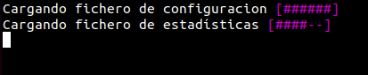
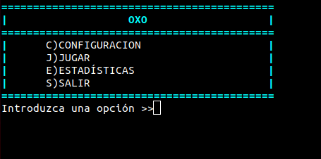
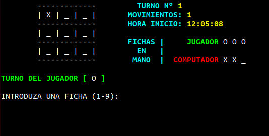

# Oxo
Tic tac toe (or "3 in a row") game implemented in Shell Script.





## Usage
To run it, just have in the same folder **oxo.sh** and **oxo.cfg** at least (you dont necessary need oxo.log to run it)

Go to **"oxo"** folder and run:
```sh
./oxo.sh [-g]
```
With [-g] option shows the creator and credits.
